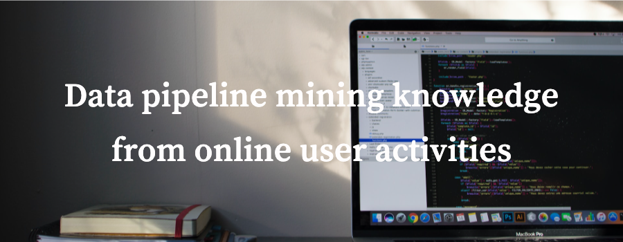
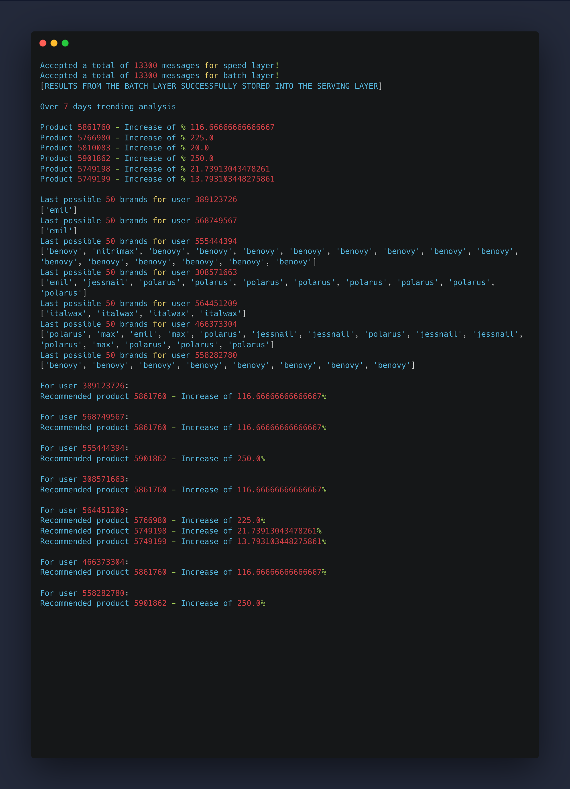
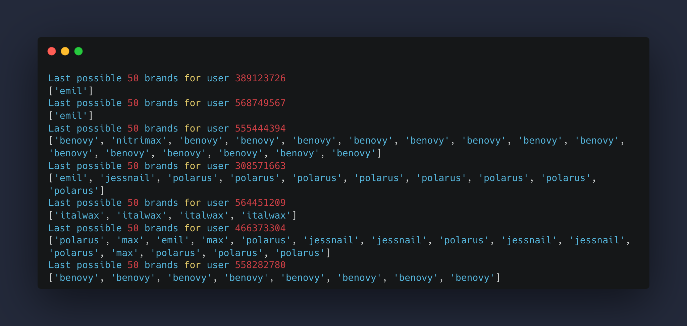
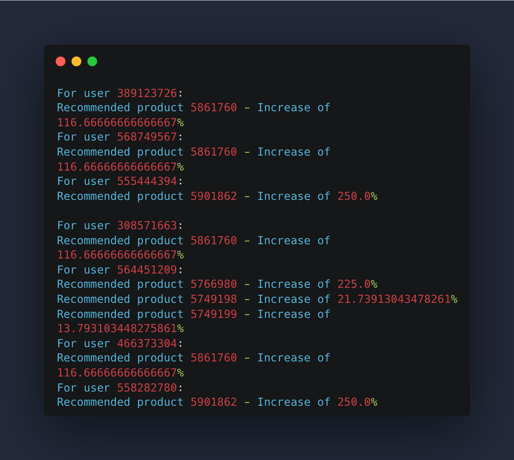
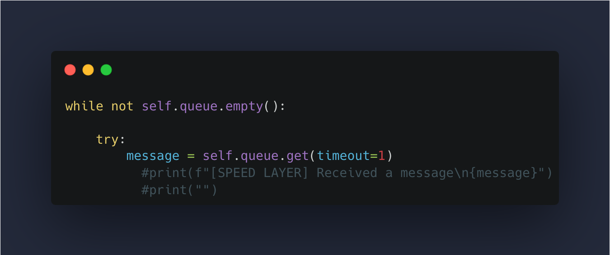
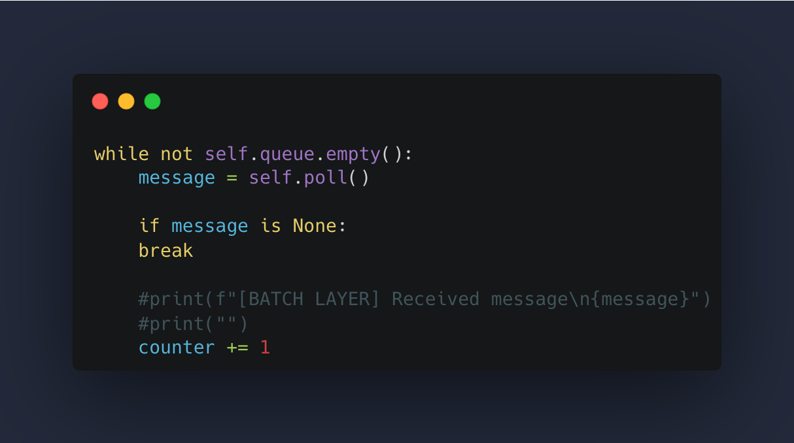
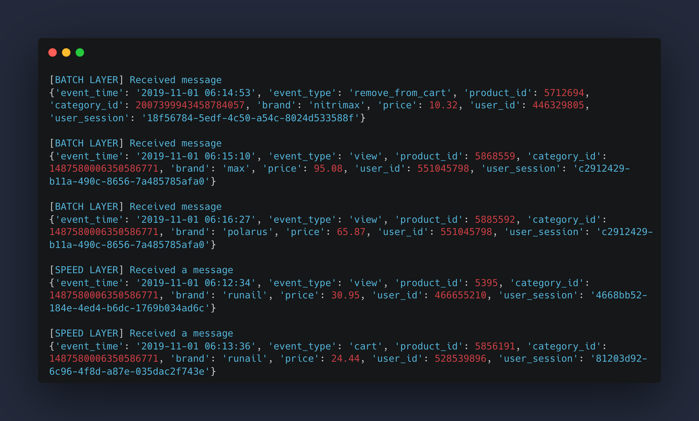

# Data Pipeline Mining Knowledge From Online User Activities


Summary of Open Avenues project

This data pipeline is designed to handle and process user-generated events in a streaming fashion, analyze the data using batch processing, and provide recommendations based on trending activities. The pipline provides user recommendations for any requested time range, in our case we have 7 days recommendation system. The pipeline is implemented in Python and utilizes various classes for different components of the pipeline.

## Table of contents
* [Motivation](#motivation)
* [Summary of approach](#summary-of-approach)
* [Results](#results)
* [What I learned](#what-I-learned)
* [How to use this repository](#how-to-use-this-repository)


<a name="Motivation"></a>
## Motivation
I was always surprised to see how the internet provides recommendations while browsing through social media and online marketplaces, so I was always very interested to learn how this recommendations work and how we can build the most accurate ones.
That is why I decided to try to make this product recommendations system.


<a name="Summary of approach"></a>
## Summary of approach
For this user recommendation project I decided to move forward with a data-processing architecture called Lambda Architecture. 


The reason why I chose to work with Lambda Architecture design is because it provides real time and batch processing. The Lambda Architecture combines both real-time (speed) and batch processing. This allows for handling both current, incoming data and historical data. Real-time processing ensures low-latency responses to user activities, while batch processing provides accurate, comprehensive analyses over longer periods.


To explain the process in simple words, we produce all of our user activities into Batch layer which holds the data for a long term (historical data). The term depends on requirements, in our case we have a database for one month and the Batch layer accepts user activities of 7 days. After accepting and storing the data, it performs the user recommendations logic and passes the results into Serving layer. The Serving layer displays the results. 

On other hand we have the Speed layer which accepts real time activities and displays the most recent activity of the user, the requirements can be different but in our case the Speed layer provides the most recent 50 browsed brands of the user.

<a name="Results"></a>
## Results
We can see our results below.



For first two lines we have the total amount of messages (user activities) received by both Batch and Speed consumers, in current case for 7 days we have 13300 messages for each consumer.

On the third line we have a notice that our results from Batch layer were successfully stored into the Serving layer.

Below the notice we have our trending results. Each product's history is being recorded by daily buckets and we can see the total increase of percentage for most trending producst.

Below are the results from the Speed layer



Speed layer is keeping track of all possible users by recording their most recent 50 brands. Some users may only have one brand because the recorded date frame is only 7 days. 

Lastly`



We can see our recommendations for each requested user.
First we look at top trending item's product's brand, then we go and check for each of our users, if the trending item's brand is present in user's most recent 50 brands then we recommend that product to user.

In case if we would like to see the actual data transformation with print statements, we can go ahead and remove the following commented lines from Batch and Speed layers.





If we remove the above comments, we can see the real time data processing as it is below `



<a name="What I learned"></a>
## What I learned 
* Building a product recommendation pipeline
* Lambda Architecture design
* Kafka broker
* Streaming analysis
* Organizing and writing our plan can actually increase our productivity.

<a name="How to use this repository"></a>
## How to use this repository
We have the Pipeline.ipynb file as well as the resources.txt. In the resources.txt file we can find the link to the dataset.
Once we download the dataset we need to store choose one file (dataset) at a time. Remember to change the below code according to your needs. For example if you take the December month dataset, you would need to change the name of the file as well as the path to your dataset file and name.
```python
nov_df = pd.read_csv('datasets/2019-Nov.csv')
```
Once we have that set up, we can go ahead and run the code.
Note that it can take some time to finish for the results due to a large dataset.
